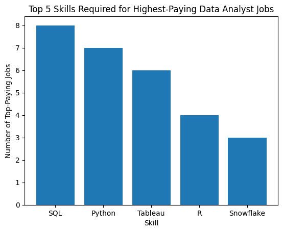

# Introduction
Dive into the data job market! Focusing on data analyst roles, this project explores top-paying jobs, in-demand skills, and where high demand skills meet high salaries. 
SQL Queries? Check them out here: [project_sql folder](/project_sql/)
# Background
Driven by a quest to navigate the data analyst job market more effectively, this project was born from a desire to pinpoint top-paid and in-demand skills, streamlining others work to find optimal jobs. 

Data and Instruction are both coming from Luke Baarousse's [SQL Course](https://lukebarousse.com/sql). He is a great teacher for these skills. The data he gathered is full of insights on job titles, salary information, locations, and essential skills.

## The questions I wanted to answer through my SQL Queries were:
1. What are the top-paying data analyst jobs?
2. What skills are required for these top-paying jobs?
3. What skills are most in demand for data analysts?
4. Which skills are associated with higher paying salaries?
5. What are the most optimal skills to learn for someone breaking into this field?

# Tools I Used
For this deep dive into the data analyst job market, I used several key tools:
- **SQL**: The backbone of this analysis, allowing me to query the database and gather critical insights.
- **PostgresSQL**: The chosen database management system, ideal for handling the job posting data provided to me.
- **VS Code**: My 'go-to' for executing SQL queries and database management
- **Git & GitHub**: Keeping track of the changes in the project as I progressed through the different queries as they built on each other. And, of course, sharing my SQL scripts and analysis to the world. 

# The Analysis

## 1. Top Paying Data Analyst Jobs
To identify the highest-paying jobs, I filtered data analyst roles by average yearly salary and location, focusing on remote jobs and jobs only where a salary was listed. This query highlights the high paying opportunities out there. 

``` SQL
SELECT
    job_id,
    job_title,
    name AS company_name,
    job_location,
    job_schedule_type,
    salary_year_avg,
    job_posted_date
FROM
    job_postings_fact
LEFT JOIN company_dim ON job_postings_fact.company_id = company_dim.company_id
WHERE
    job_title_short = 'Data Analyst' AND
    job_location = 'Anywhere' AND
    salary_year_avg IS NOT NULL
ORDER BY
    salary_year_avg DESC
LIMIT 10
```
Here's the breakdown of these findings (this data set is from 2023):
- **Wide Salary Range**: The top 10 jobs listed ranged from $650,000 on the high end all the way down to $184,000 on the low end. 
- **Diverse Employers**: Companies like SmartAsset, Meta, and AT&T are among the companies that were offering high salaries.
- **Job Title Variety**: There is a wide variety of job titles at this top end as well from Data Analyst to Director of Analytics, reflecting the varied roles out there for data analytics. 

## 2. Skills for Top Paying Jobs
To understand what skills are required for the top-paying jobs, I joined the job postings data table with the skills data table, providing a list of skills employers value for highly-compensated roles. 

```SQL
WITH top_paying_jobs AS (

    SELECT
        job_id,
        job_title,
        name AS company_name,
        salary_year_avg
    FROM
        job_postings_fact
    LEFT JOIN company_dim ON job_postings_fact.company_id = company_dim.company_id
    WHERE
        job_title_short = 'Data Analyst' AND
        job_location = 'Anywhere' AND
        salary_year_avg IS NOT NULL
    ORDER BY
        salary_year_avg DESC
    LIMIT 10
)

SELECT 
    top_paying_jobs.*,
    skills
FROM top_paying_jobs
INNER JOIN skills_job_dim ON top_paying_jobs.job_id = skills_job_dim.job_id
INNER JOIN skills_dim ON skills_job_dim.skill_id = skills_dim.skill_id
ORDER BY
    salary_year_avg DESC
```
Here's the breakdown of the most demanded skills for the top 10 highest paying data analyst jobs (in 2023):
- **SQL** is leading with a count of 8.
- **Python** follows with a count of 7.
- **Tableau** is also highly valued with a count of 6. 
- Other skills like **R, Snowflake, Pandas,** and **Excel** show varying degrees of demand.



*This is a bar graph showing these results generated using ChatGPT.*

## 3. In-Demand Skills for Data Analysts
This query helped identify the skills most frequently requested in job postings, directing focus to areas with high demand.
```SQL
SELECT
    skills,
    COUNT(skills_job_dim.job_id) AS demand_count
FROM job_postings_fact
INNER JOIN skills_job_dim ON job_postings_fact.job_id = skills_job_dim.job_id
INNER JOIN skills_dim ON skills_job_dim.skill_id = skills_dim.skill_id
WHERE 
    job_title_short = 'Data Analyst' AND
    job_work_from_home = TRUE
GROUP BY
    skills
ORDER BY
    demand_count DESC
LIMIT 5
```
Here's the breakdown of the most demanded skills for data analysts (in 2023):
- **SQL** and **Excel** remain fundamental, emphasizing the need for strong foundational skills in data processing and spreadsheet management. 
- **Programming** and **Data Visualization Tools** like **Python, Tableau** and **Power BI** are essential, pointing towards the increasing importance of technical skills in data storytelling and decision support. Decisions should be driven by data. 


| Skill     | Demand Count |
|-----------|--------------|
| SQL       | 7,291        |
| Excel     | 4,611        |
| Python    | 4,330        |
| Tableau   | 3,745        |
| Power BI  | 2,609        |

*Table of the demand for the top 5 skills in data analyst job postings*


## 4. Skills Based on Salary
Exploring the average salaries associated with different skills revealed which skills are the highest paying.

```SQL
SELECT
    skills,
    ROUND(AVG(salary_year_avg), 0) AS avg_salary
FROM job_postings_fact
INNER JOIN skills_job_dim ON job_postings_fact.job_id = skills_job_dim.job_id
INNER JOIN skills_dim ON skills_job_dim.skill_id = skills_dim.skill_id
WHERE 
    job_title_short = 'Data Analyst'
    AND salary_year_avg IS NOT NULL
    AND job_work_from_home = TRUE
GROUP BY
    skills
ORDER BY
    avg_salary DESC
LIMIT 25
```
Here's a breakdown of the results for the top paying skills for Data Analysts:
- **High Demand for Big Data & ML Skills**: Top salaries are led by analysts skilled in big data technologies (PySpark, Couchbase), machine learning tools (DataRobot, Jupyter), and Python libraries (Pandas, NumPy), reflecting the industry's high valuation of data processing and predictive modeling capabilities. I'm sure that since this data was acessed in 2023 this has only grown in the past two years with the growth of AI. 
- **Software Developing & Deployment Proficiency**: Knowledge of development and deployment tools (GitLab, Kubernetes, AirFlow) indicates a lucrative crossover between data analysis and engineering, with a premium on skills that facilitate automation and efficient data pipeline management. This would explain why we covered a bit of SQL in a full-stack web development course I attended in 2023. 
- **Cloud Computing Expertise**: Familiarity with cloud computing and data engineering tools (Elasticsearch, Databricks, GCP) underscores the ever-growing importance of cloud-based management. This suggests that cloud proficiency significatly boosts earning potential in data analytics. The more you know. 

| Skill          | Avg Salary ($) |
|----------------|----------------|
| PySpark        | 208,172        |
| Bitbucket      | 189,155        |
| Couchbase      | 160,515        |
| Watson         | 160,515        |
| DataRobot      | 155,486        |
| GitLab         | 154,500        |
| Swift          | 153,750        |
| Jupyter        | 152,777        |
| Pandas         | 151,821        |
| Elasticsearch  | 145,000        |

*Table shows the average salary for the top 10 paying skills for data analysts.*

## 5. Most Optimal Skills to Learn
Combining all insights from demand and salary data, this query was able to pinpoint skills that are both high in demand and have high salaries, offering a strategic focus for skill development.

```SQL
SELECT  
    skills_dim.skill_id,
    skills_dim.skills,
    COUNT(skills_job_dim.job_id) AS demand_count,
    ROUND(AVG(job_postings_fact.salary_year_avg),0) AS avg_salary
FROM 
    job_postings_fact
INNER JOIN skills_job_dim ON job_postings_fact.job_id = skills_job_dim.job_id
INNER JOIN skills_dim ON skills_job_dim.skill_id = skills_dim.skill_id
WHERE
    job_title_short = 'Data Analyst'
    AND salary_year_avg IS NOT NULL
    AND job_work_from_home = TRUE
GROUP BY
    skills_dim.skill_id
HAVING
    COUNT(skills_job_dim.job_id) > 20
ORDER BY
    avg_salary DESC,
    demand_count DESC
LIMIT 25;
```
| Skill        | Demand Count | Avg Salary ($) |
|--------------|--------------|----------------|
| Go           | 27           | 115,320        |
| Hadoop       | 22           | 113,193        |
| Snowflake    | 37           | 112,948        |
| Azure        | 34           | 111,225        |
| AWS          | 32           | 108,317        |
| Oracle       | 37           | 104,534        |
| Looker       | 49           | 103,795        |
| Python       | 236          | 101,397        |
| R            | 148          | 100,499        |
| Tableau      | 230          | 99,288         |
| SAS          | 63           | 98,902         |
| SQL Server   | 35           | 97,786         |
| Power BI     | 110          | 97,431         |
| SQL          | 398          | 97,237         |
| Flow         | 28           | 97,200         |
| SPSS         | 24           | 92,170         |
| VBA          | 24           | 88,783         |
| PowerPoint   | 58           | 88,701         |
| Excel        | 256          | 87,288         |
| Sheets       | 32           | 86,088         |
| Word         | 48           | 82,576         |

*Table of the most optimal skills for data analyst sorted by salary.*

Here's a breakdown of the most optimal skils for Data Analysts (in 2023):
- High-demand skills (**SQL, Python, Excel**) maximize job opportunities

- **Cloud, engineering, and distributed systems** skills drive higher salaries

- The highest-paying data analyst roles **blend** analytics, engineering, and infrastructure knowledge

- This highlights a clear strategy for career growth: **master the fundamentals**, then specialize toward cloud and production-oriented analytics to maximize earning potential.


# What I Learned
When taking a Full-Stack Web Development course, we touched briefly on SQL using MySQL. This was the first time that databases started to click with my brain and I liked the way I could easily understand the things that where happening inside the tables. 

This was a new challenge for me. Most of the data projects I've been working on professionally have been in Excel. Here are three main takeaways from putting my brain through this process:

- **Complex Querying**: In this I learned basic and advance SQL, merging tabels, creating subqueries, and even temporary tables - all things I didn't know about before. 
- **Data Aggregation**: This one took me a while to understand. But using GROUP BY with COUNT() and AVG(), I began to see the power in these tools. 
- **Analytical Analysis**: I thought that the questions posed in this coursework were great to show real-world data that would be useful not only to myself but to others looking for jobs in data analysis. Turns out, asking good questions is only half the plan. 

# Conclusions

## Insights
1. **Top-Paying Data Analyst Jobs**: The highest paying jobs for data analysts that allow remote work offer a wide range of salaries, the highest at $650,000.
2. **Skills for Top-Paying Jobs**: High-paying jobs for data analysts require advanced proficiency in SQL, suggesting it's cucial for earning a top salary in this field.
3. **Most In-Demand Skills**: SQL is also the most demanded skill required for data analysts seeking a job in this career path. 
4. **Skills with Higher Salaries**: Specialized skills, such as SVN and Solidity, are associated with the highest average salaries from this data set, suggesting top dollar for specialized expertise. 
5. **Optimal Skills for Job Market Value**: SQL leads in demand and offers for a high average salary, placing it as one of the most optimal skills for data analysts. Other skills are also skills listed in the upcoming coursework like Excel, Python, and Power BI.

## Closing Thoughts

This project taught me a lot of SQL skills. I found the most challenging skills in the Advanced section of this coursework and a lot of the practice problems would take me a while to wrap my head around before even attempting to solve them. Most of the time I was able to get close to the answer but I learned just how specific SQL likes you to be when making queries. 

As for the practice data itself. This project showed me that my endeavor is not in vain. I hope to be able to walk away from this project and the next few courses that follow with a great skill set under my belt to enter into a competitive workforce with powerful knowledge. After all, knowledge is power. 